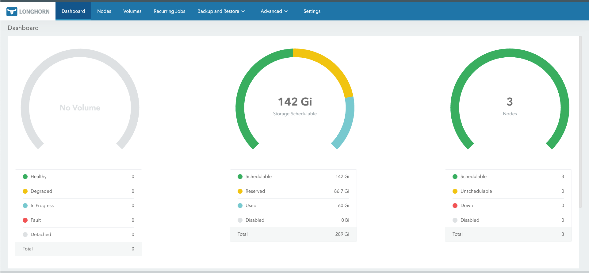

# # Longhorn Chart : https://longhorn.io/docs/1.10.1/deploy/install/install-with-helm/ 

## Prerequisites : https://longhorn.io/docs/1.10.1/deploy/install/#installation-requirements

1. A container runtime compatible with Kubernetes (Docker v1.13+, containerd v1.3.7+, etc.)
2. Kubernetes >= v1.25
3. Make sure `bash`, `curl`, `findmnt`, `grep`, `awk` and `blkid` has been installed in all nodes of the Kubernetes cluster.
4. Make sure `open-iscsi` has been installed, and the `iscsid` daemon is running on all nodes of the Kubernetes cluster. For GKE, recommended Ubuntu as guest OS image since it contains `open-iscsi` already.

```bash
# For Ubuntu 24.04 LTS other distribution refer the URL
sudo apt-get install open-iscsi
modprobe iscsi_tcp
```

5. RWX support requires that each node has a NFSv4 client installed. For installing a NFSv4 client, refer to Installing NFSv4 Client.
```bash
# For Ubuntu 24.04 LTS other distribution refer the URL
sudo apt-get install nfs-common
```

6. The host filesystem supports the file extents feature to store the data. Currently we support:
ext4
XFS
bash, curl, findmnt, grep, awk, blkid, lsblk must be installed.
Mount propagation must be enabled.
The Longhorn workloads must be able to run as root in order for Longhorn to be deployed and operated properly.

Longhorn Command Line Tool can be used to check the Longhorn environment for potential issues

> **Important**: Please install the Longhorn chart in the `longhorn-system` namespace only.

> **Warning**: Longhorn doesn't support downgrading from a higher version to a lower version.

> **Note**: Use Helm 3 when installing and upgrading Longhorn. Helm 2 is [no longer supported](https://helm.sh/blog/helm-2-becomes-unsupported/).


## Source Code
Longhorn is 100% open source software. Project source code is spread across a number of repos:

1. Longhorn Engine -- Core controller/replica logic https://github.com/longhorn/longhorn-engine
2. Longhorn Instance Manager -- Controller/replica instance lifecycle management https://github.com/longhorn/longhorn-instance-manager
3. Longhorn Share Manager -- NFS provisioner that exposes Longhorn volumes as ReadWriteMany volumes. https://github.com/longhorn/longhorn-share-manager
4. Backing Image Manager -- Backing image file lifecycle management. https://github.com/longhorn/backing-image-manager
5. Longhorn Manager -- Longhorn orchestration, includes CSI driver for Kubernetes https://github.com/longhorn/longhorn-manager
6. Longhorn UI -- Dashboard https://github.com/longhorn/longhorn-ui


## Upgrading to Kubernetes v1.25+

Starting in Kubernetes v1.25, [Pod Security Policies](https://kubernetes.io/docs/concepts/security/pod-security-policy/) have been removed from the Kubernetes API.

As a result, **before upgrading to Kubernetes v1.25** (or on a fresh install in a Kubernetes v1.25+ cluster), users are expected to perform an in-place upgrade of this chart with `enablePSP` set to `false` if it has been previously set to `true`.

> **Note:**
> If you upgrade your cluster to Kubernetes v1.25+ before removing PSPs via a `helm upgrade` (even if you manually clean up resources), **it will leave the Helm release in a broken state within the cluster such that further Helm operations will not work (`helm uninstall`, `helm upgrade`, etc.).**
>
> If your charts get stuck in this state, you may have to clean up your Helm release secrets.
Upon setting `enablePSP` to false, the chart will remove any PSP resources deployed on its behalf from the cluster. This is the default setting for this chart.

As a replacement for PSPs, [Pod Security Admission](https://kubernetes.io/docs/concepts/security/pod-security-admission/) should be used. Please consult the Longhorn docs for more details on how to configure your chart release namespaces to work with the new Pod Security Admission and apply Pod Security Standards.

## Refer Best Practices: https://longhorn.io/docs/1.10.1/best-practices/ 

## Installation

1. Add Longhorn chart repository.
```bash
helm repo add longhorn https://charts.longhorn.io
```

2. Update local Longhorn chart information from chart repository.
```bash
helm repo update
```

3. Use the following commands to create the `longhorn-system` namespace first, then install the Longhorn chart.
```bash
kubectl create namespace longhorn-system
helm install longhorn longhorn/longhorn --namespace longhorn-system
```

## Uninstallation

``` bash
# run the longhorn-cleanup.sh file to remove all the longhorn related crds 
# and 
# Verify 
kubectl -n longhorn-system patch -p '{"value": "true"}' --type=merge lhs deleting-confirmation-flag
helm uninstall longhorn -n longhorn-system
kubectl delete namespace longhorn-system
```

### Create an Ingress with basic Authentication 

```bash
# Create a basic auth file auth. It’s important the file generated is named auth (actually - that the secret has a key data.auth), otherwise the Ingress returns a 503.

USER=ganesh; PASSWORD=P@ssw0rd@123; echo "${USER}:$(openssl passwd -stdin -apr1 <<< ${PASSWORD})" >> auth

# Create a secret:
kubectl -n longhorn-system create secret generic basic-auth --from-file=auth
```

```yaml
# Create an Ingress manifest longhorn-ingress.yml :
apiVersion: networking.k8s.io/v1
kind: Ingress
metadata:
  name: longhorn-ingress
  namespace: longhorn-system
  annotations:
    # type of authentication
    nginx.ingress.kubernetes.io/auth-type: basic
    # prevent the controller from redirecting (308) to HTTPS
    nginx.ingress.kubernetes.io/ssl-redirect: 'false'
    # name of the secret that contains the user/password definitions
    nginx.ingress.kubernetes.io/auth-secret: basic-auth
    # message to display with an appropriate context why the authentication is required
    nginx.ingress.kubernetes.io/auth-realm: 'Authentication Required '
    # custom max body size for file uploading like backing image uploading
    nginx.ingress.kubernetes.io/proxy-body-size: 10000m
    # Important: Rewrite the path to remove /longhorn prefix
    nginx.ingress.kubernetes.io/rewrite-target: /$2
    nginx.ingress.kubernetes.io/use-regex: "true"
spec:
  ingressClassName: nginx
  rules:
  - http:
      paths:
      - pathType: ImplementationSpecific
        path: /longhorn(/|$)(.*)
        backend:
          service:
            name: longhorn-frontend
            port:
              number: 80
```

```bash
# Create the Ingress
kubectl -n longhorn-system apply -f longhorn-ingress.yml

#Verify the Ingress
kubectl -n longhorn-system get ingress
```

## After logging in 

